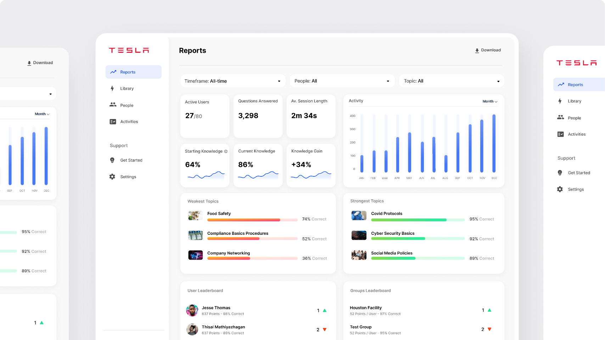
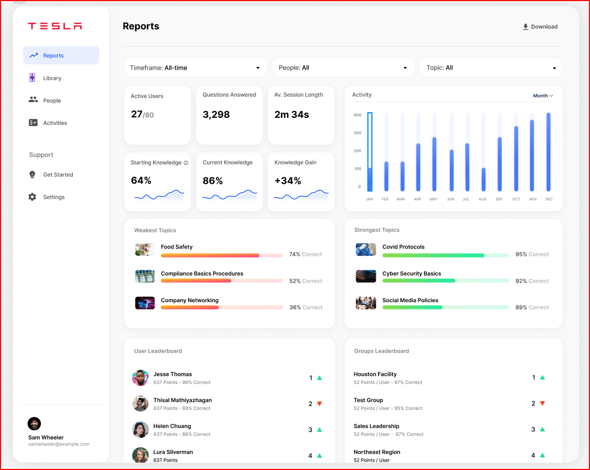
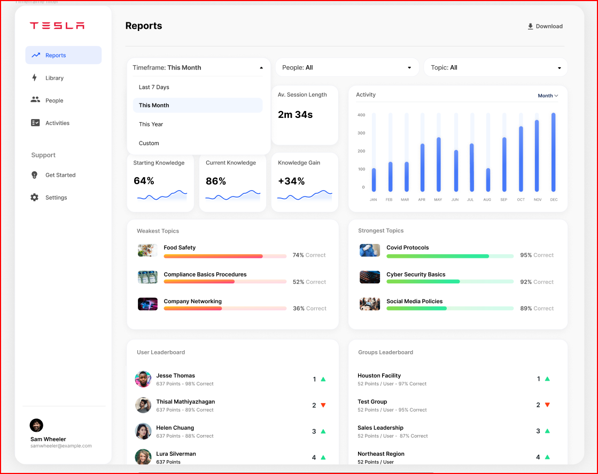
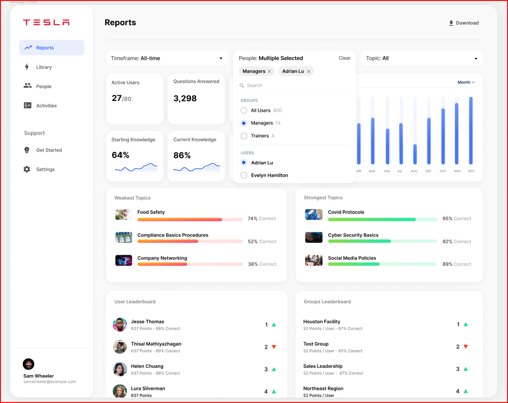

# Analytics Dashboard.

One of my personal Qt based project to showcase my long honed skills in Python-bindings for Qt (C++) : PyQt, PySide.

## Figma Link

https://www.figma.com/community/file/1152266255337829742/analytics-dashboard

credits to [Lindsay](https://www.figma.com/@lho)

## Images

- Cover
- Main
- Timeframe Filter 
- Group Filter
